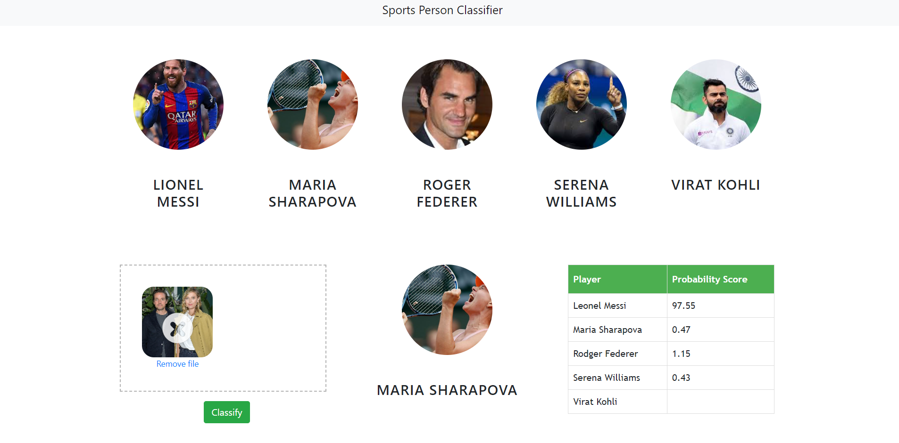
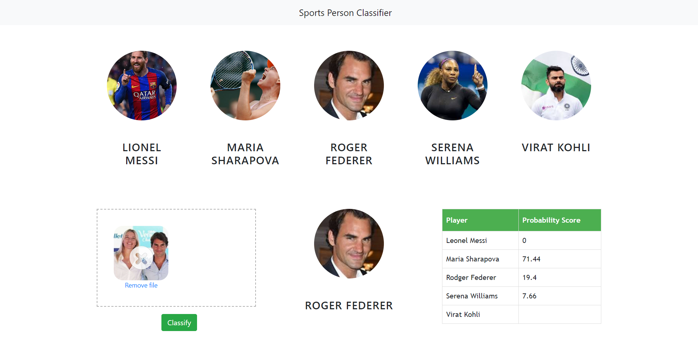
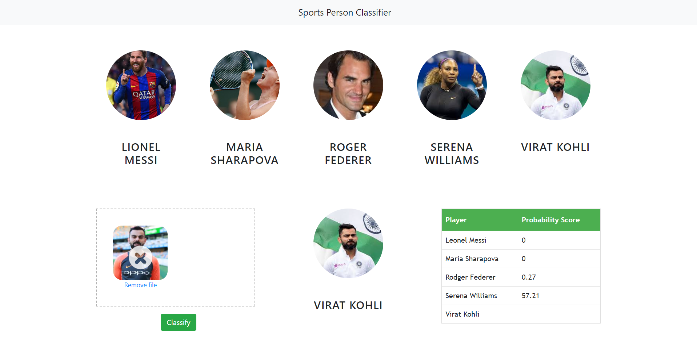
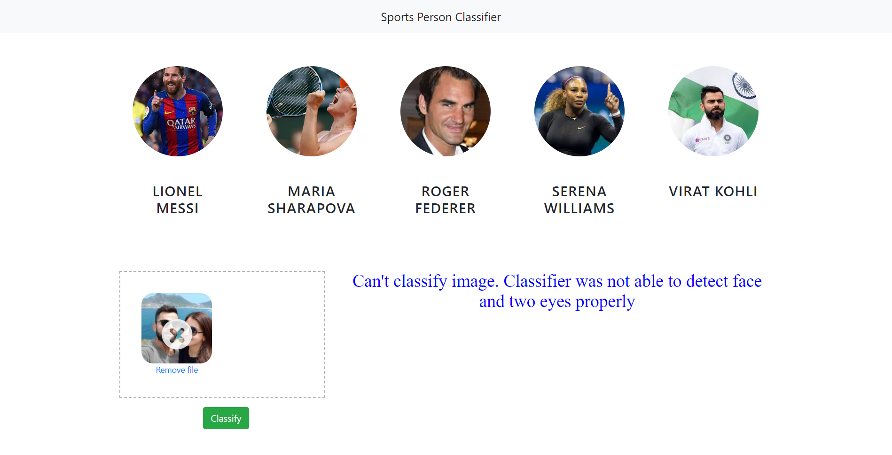

# 🧠 Celebrity Face Recognition (Sports Edition)

A web-based face recognition system that classifies sports celebrities from uploaded images using OpenCV, wavelet feature extraction, and a pre-trained scikit-learn model.

---

## 🚀 Features

- Upload an image and classify the face in real-time
- Supports multiple sports celebrities
- Detects face and eyes using Haar cascades
- Uses wavelet transforms for robust feature extraction
- Powered by Flask backend and Dropzone.js frontend

---

## 🧰 Tech Stack

- **Frontend**: HTML, CSS, JavaScript, Dropzone.js  
- **Backend**: Python, Flask  
- **ML/AI**: OpenCV, Scikit-learn, Wavelet Transform  
- **Model**: Pre-trained `.pkl` model using joblib

---

## 📦 How to Run

```bash
# 1. Install dependencies
pip install -r requirements.txt

# 2. Run the Flask server
python server.py
```

---

## 📸 Output Examples

<div align="center">
  
  
  
  
</div>

---